# TOCO
TOCO is a web application designed to help users learn a new language . With TOCO, users can choose from a variety of languages and skill levels, and then work through a series of lessons to improve their vocabulary, grammar, and pronunciation. Users can track their progress over time. Whether you're a beginner or an advanced learner, TOCO is the perfect tool to help you master a new language.

## Requirement
- Docker

## Installation
1. Clone this repository
2. make sure that the docker engine is up and running
3. run `docker-compose up`
4. enjoy at `localhost:8008`

## screenshots
- homepage
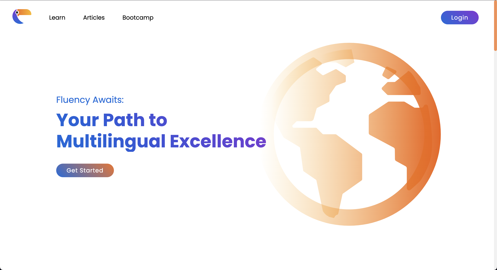
- login
  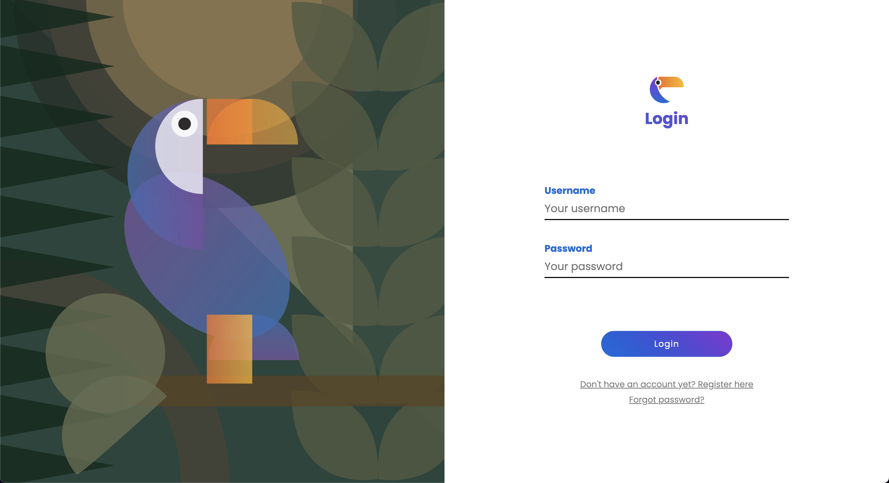
- register
  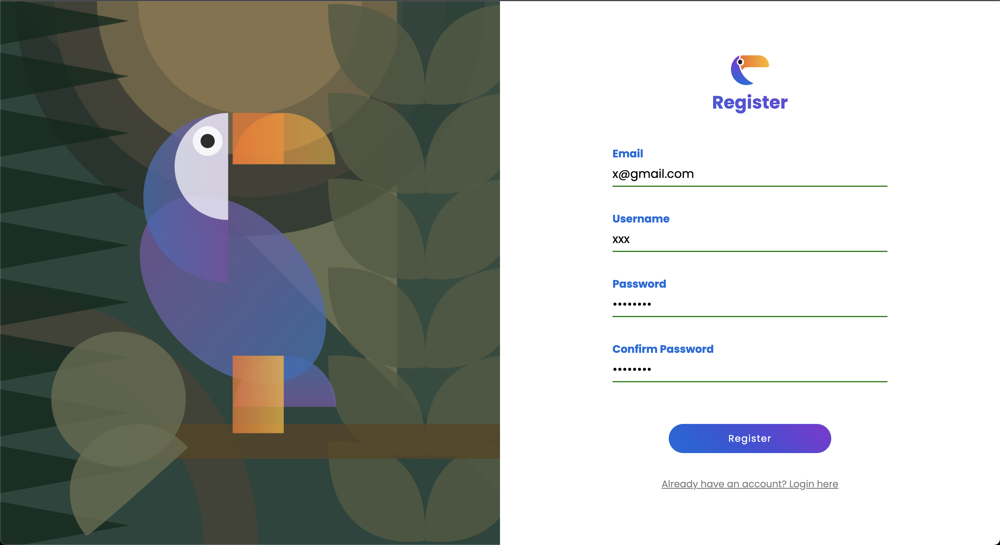
- choose language
    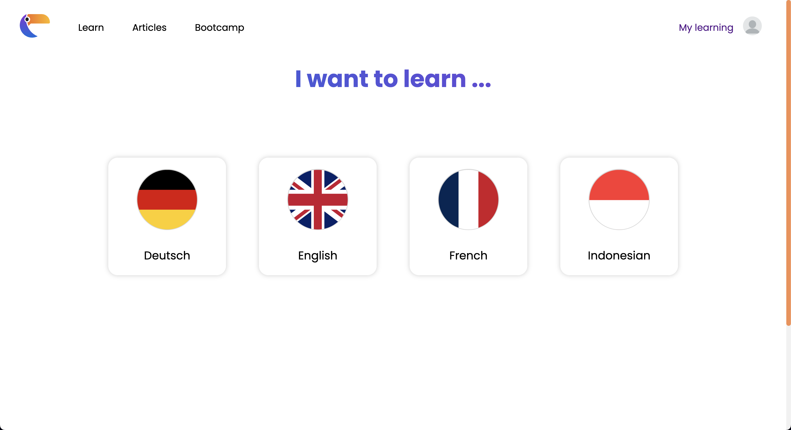
- choose module
  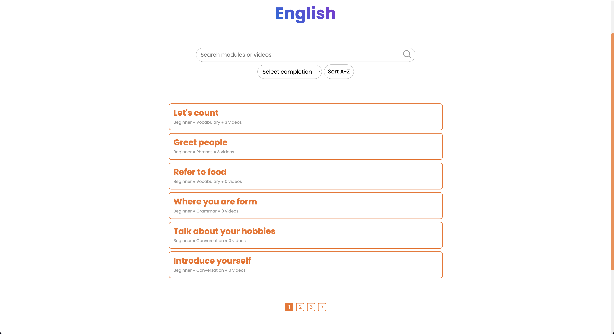
- video
  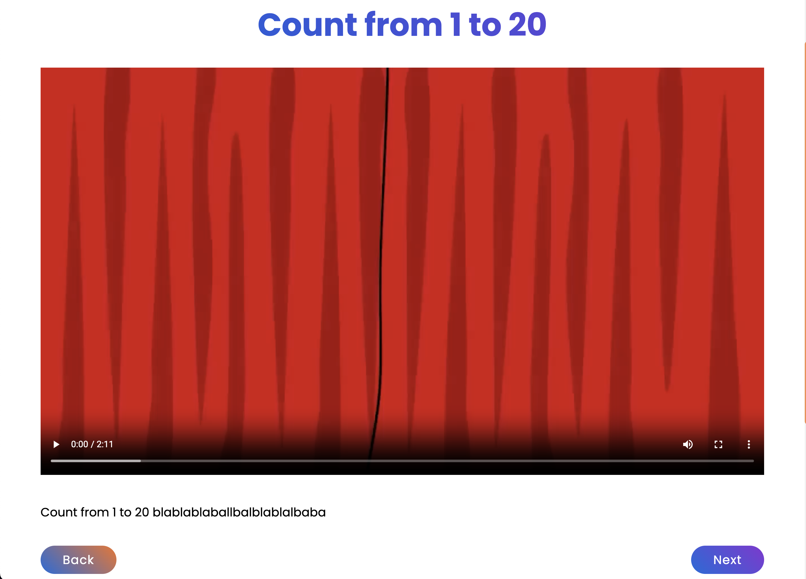
- admin dashboard
  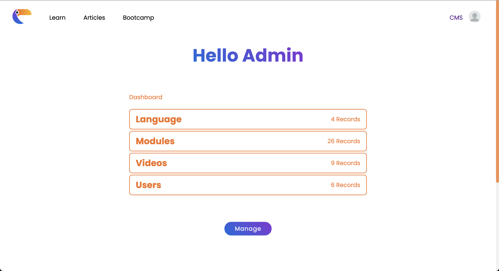
- edit module
  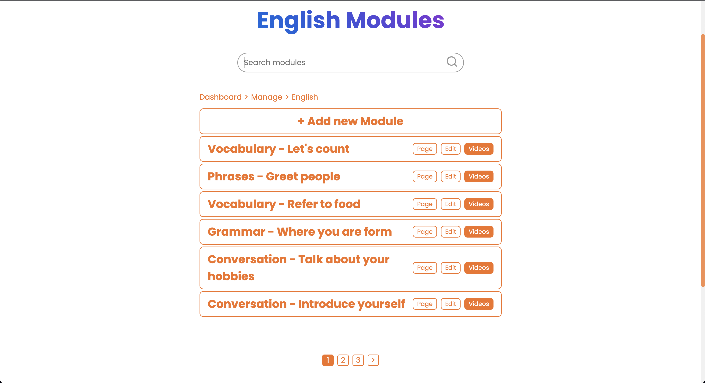
- edit lesson
  
- edit video
  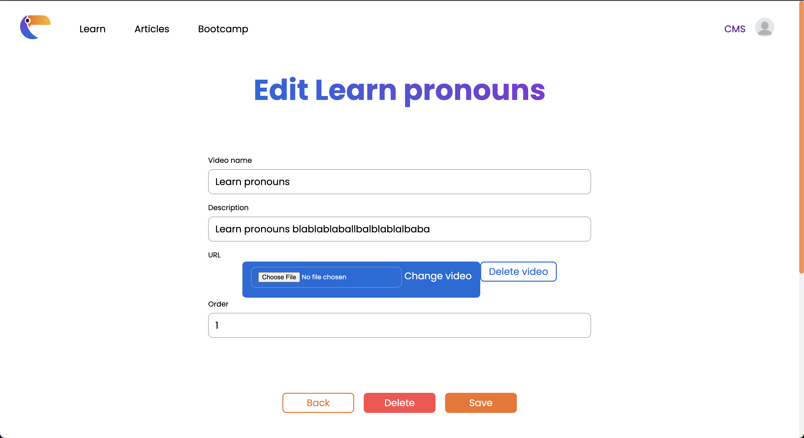

## Pembagian Tugas
### _Server Side_

| Fitur                    | NIM      |
| ------------------------ | -------- |
| Login                    |  13521021|
| Register                 |  13521021        |
| Search                   | 13521019 |
| Sort dan Filter          |  13521019 |
| Daftar Bahasa            | 13521019,13521021, 13521022  |
| Tambah Bahasa             | 13521021, 13521022 |
| Edit Bahasa             | 13521021, 13521022 |
| Daftar Modul              |13521021, 13521022 |
| Tambah Modul             | 13521021|
| Edit Modul             | 13521021|
| Daftar Video|  13521021, 13521022|
| Tambah Video             | 13521021 |
| Edit Video            | 13521021 |
| Profile             | 13521021 |
| Pagination               | 13521019         |

### _Client Side_

| Page                     | NIM      |
| ------------------------ | -------- |
| Login                    | 13521021         |
| Register                 | 13521021         |
| Profile                     |     13521021     |
| Home                     | 13521019, 13521021 |
| My Learning              | 13521021 |
| Pilih Bahasa              | 13521021 |
| Daftar Modul              | 13521019 |
| Video              | 13521022 |
| Admin Dashboard           | 13521019 |
| Admin Daftar Bahasa              | 13521019 |
| Admin Tambah Bahasa              | 13521019, 13521022 |
| Admin Edit Bahasa              | 13521019 |
| Admin Daftar Modul              | 13521019 |
| Admin Tambah Modul              | 13521019, 13521022 |
| Admin Edit Modul              | 13521019 |
| Admin Daftar Video              | 13521019 |
| Admin Tambah Video              | 13521019, 13521022 |
| Admin Edit Video              | 13521019 |
| 404             | 13521021 |

| Component                | NIM      |
| ------------------------ | -------- |
| Navigation Bar           |  13521021|
| Footer               | 13521019 |
| Toast               | 13521019 |
| Modal               | 13521019 |

### _Database_

| Fitur                    | NIM      |
| ------------------------ | -------- |
| Users                    | 13521021         |
| Languages                     | 13521021 |
| Modules                    | 13521021 |
| Videos                    | 13521021 |
| Progress                    | 13521021,13521022 |
| Modules_result                    | 13521021 |
| Videos_result                    | 13521021 |

### _Setup_

| Setup                    | NIM      |
| ------------------------ | -------- |
| Database                 |     13521019, 13521021, 13521022     |
| Docker                   |       13521021   |
| MVC                      |  13521019, 13521021, 13521022|

## Bonus
- [x] Responsive Design
- Mobile
- Tablet
- Laptop
- Desktop
- [x] Docker
- [x] Google Lighthouse
- Performance 94%
- Accessibility 96%
- Best Practices 100%
- SEO 91%
! [lighthouse](img/lighthouse.png)
 
## New Features
- [x] buying merch
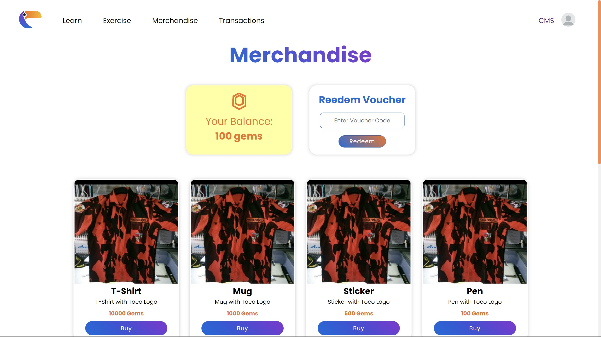
- [x] doing exercise
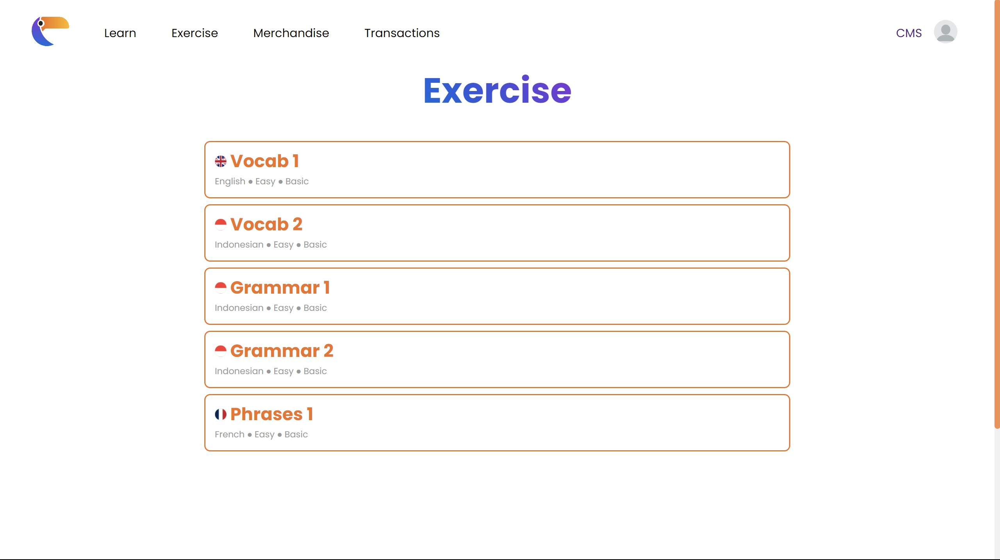
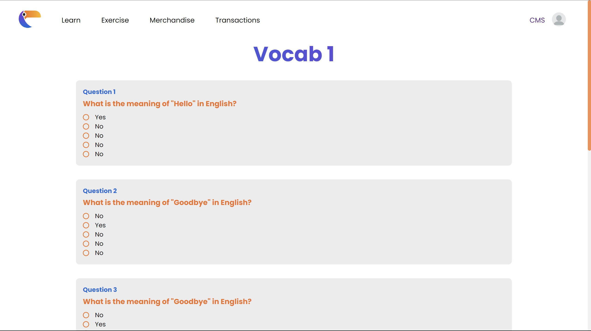
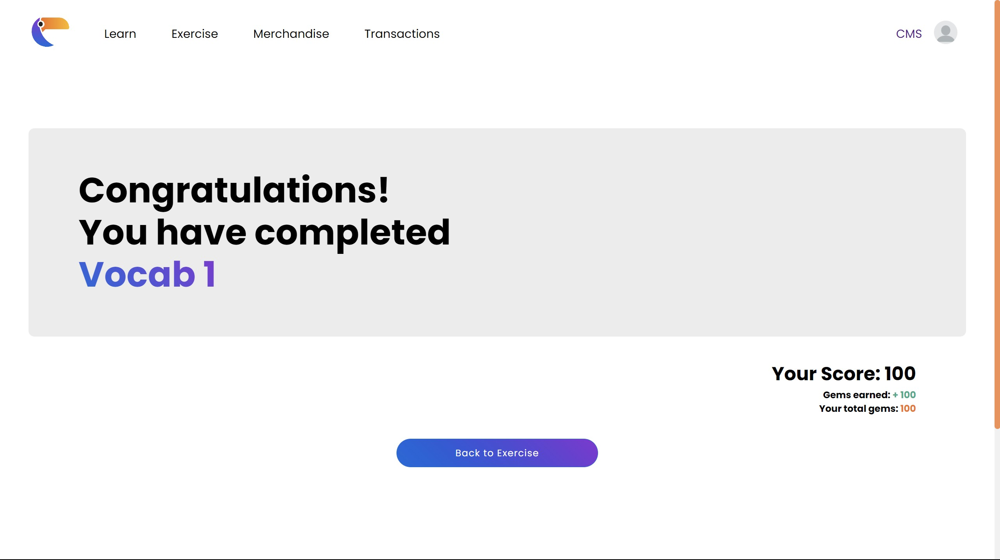 
- [x] transaction overview
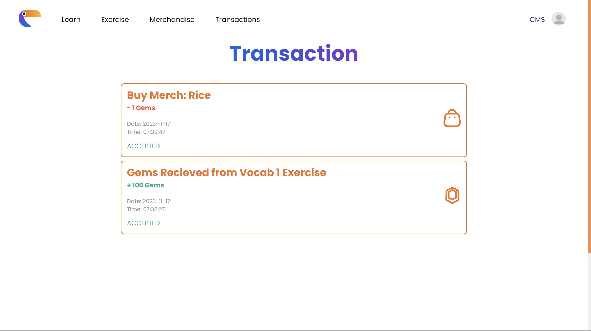

