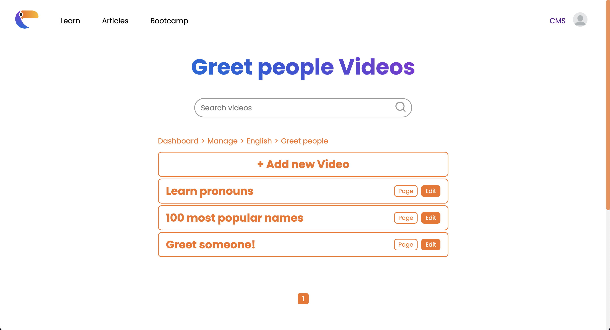

## Panduan Pengerjaan
Berikut adalah hal yang harus diperhatikan untuk pengumpulan tugas ini:
1. Buatlah grup pada Gitlab dengan format "IF3110-2023-01-XX", dengan XX adalah nomor kelompok (untuk K1 dan K2) atau kode kelompok (untuk K3).
2. Tambahkan anggota tim pada grup anda.
3. **Fork** pada repository ini dengan organisasi yang telah dibuat.
4. Ubah hak akses repository hasil Fork anda menjadi **private**.
5. Hal-hal yang harus diperhatikan.
    * Silakan commit pada repository anda (hasil fork)
    * Lakukan beberapa commit dengan pesan yang bermakna, contoh: “add register form”, “fix logout bug”, jangan seperti “final”, “benerin dikit”, “fix bug”.
    * Disarankan untuk tidak melakukan commit dengan perubahan yang besar karena akan mempengaruhi penilaian (contoh: hanya melakukan satu commit kemudian dikumpulkan).
    * Commit dari setiap anggota tim akan mempengaruhi penilaian.
    * Jadi, setiap anggota tim harus melakukan commit yang berpengaruh terhadap proses pembuatan aplikasi.
    * Sebagai panduan bisa mengikuti [semantic commit](https://gist.github.com/joshbuchea/6f47e86d2510bce28f8e7f42ae84c716).
6. Buatlah file README yang berisi:
    * Deskripsi aplikasi web
    * Daftar requirement
    * Cara instalasi
    * Cara menjalankan server
    * Screenshot tampilan aplikasi (tidak perlu semua kasus, minimal 1 per halaman), dan 
    * Penjelasan mengenai pembagian tugas masing-masing anggota (lihat formatnya pada bagian pembagian tugas).


# TOCO
TOCO is a web application designed to help users learn a new language . With TOCO, users can choose from a variety of languages and skill levels, and then work through a series of lessons to improve their vocabulary, grammar, and pronunciation. Users can track their progress over time. Whether you're a beginner or an advanced learner, TOCO is the perfect tool to help you master a new language.

## Requirement
- Docker

## Installation
1. Clone this repository
2. make sure that the docker engine is up and running
3. run `docker-compose up`
4. enjoy at `localhost:8008`

## screenshots
- homepage

- login
  
- register
  
- choose language
    
- choose module
  
- video
  
- admin dashboard
  
- edit module
  
- edit lesson
  
- edit video
  


## Pembagian Tugas

## Repository Tree
```
.
|____.DS_Store
|____app
| |____init.php
| |____core
| | |____Controller.php
| | |____App.php
| | |____Database.php
| |____models
| | |____ModuleModel.php
| | |____ProgressModel.php
| | |____LanguageModel.php
| | |____UserModel.php
| | |____VideoModel.php
| |____controllers
| | |____MyLearning.php
| | |____Login.php
| | |____Register.php
| | |____Home.php
| | |____Error404.php
| | |____Learn.php
| | |____Profile.php
| | |____Admin.php
| |____views
| | |____home
| | | |____index.php
| | |____navbar
| | | |____index.php
| | |____footer
| | | |____index.php
| | |____video
| | | |____index.php
| | |____learn
| | | |____index.php
| | |____toast
| | | |____index.php
| | |____admin
| | | |____module
| | | | |____index.php
| | | |____language
| | | | |____index.php
| | | |____dashboard
| | | | |____index.php
| | | |____edit
| | | | |____video
| | | | | |____index.php
| | | | |____module
| | | | | |____index.php
| | | | |____language
| | | | | |____index.php
| | | |____manage
| | | | |____index.php
| | | |____create
| | | | |____video
| | | | | |____index.php
| | | | |____module
| | | | | |____index.php
| | | | |____language
| | | | | |____index.php
| | |____mylearning
| | | |____index.php
| | |____register
| | | |____index.php
| | |____Error404
| | | |____index.php
| | |____profile
| | | |____index.php
| | |____lesson
| | | |____index.php
| | |____login
| | | |____index.php
| | |____header
| | | |____index.php
|____index.php
|____config
| |____dotenv.php
| |____config.php
| |____.env
|____Dockerfile
|____README.md
|____img
| |____learning.png
| |____login.png
| |____homepage-user.png
| |____register.png
| |____admin-dashboard.png
| |____edit-module-vid.png
| |____homepage-guest.png
| |____edit-video.png
| |____module.png
| |____my-learning.png
| |____video.png
| |____profile.png
| |____edit-module.png
| |____edit-language.png
|____public
| |____video
| | |____default.mp4
| |____css
| | |____register.css
| | |____home.css
| | |____create.css
| | |____lesson.css
| | |____mylearning.css
| | |____global.css
| | |____login.css
| | |____dashboard.css
| | |____navbar.css
| | |____modal.css
| | |____toast.css
| | |____admin-global.css
| | |____manage.css
| | |____error.css
| | |____video.css
| | |____footer.css
| | |____learn.css
| | |____profile.css
| |____images
| | |____about-image.png
| | |____banner-image.png
| | |____tuco-artwork.png
| | |____feature-1.png
| | |____feature-3.png
| | |____feature-2.png
| |____js
| | |____profile.js
| | |____navbar.js
| | |____create-language.js
| | |____create-video.js
| | |____module-card.js
| | |____register.js
| | |____edit-video.js
| | |____create-module.js
| | |____search-filter-sort.js
| | |____manage-search.js
| | |____edit-module.js
| | |____edit-language.js
| | |____modal.js
| | |____toast.js
| |____icons
| | |____earth.svg
| | |____logo.ico
| | |____checked.svg
| | |____profile.webp
| | |____youtube_icon.svg
| | |____instagram_icon.svg
| | |____trophy.svg
| | |____gr-flag.svg
| | |____search-icon.svg
| | |____twitter_icon.svg
| | |____uk-flag.svg
| | |____fr-flag.svg
| | |____facebook_icon.svg
| | |____id-flag.svg
| | |____logo.svg
| |____imgdata
| | |____video
| | | |____LearnPronounsInEnglish.mp4
| | | |____y2mate.is - Demo Background Sample Video-K4TOrB7at0Y-144pp-1696607692.mp4
| | | |____ReadingBigNumbersInEnglish.mp4
| | | |____LearnGreetingsInEnglish.mp4
| | | |____How to introduce yourself in Indonesian.mp4
| | | |____10 basic phrases for your first conversation.mp4
| | | |____y2mate.is - Video lucu singkat.untuk story wa-zciZMLEcjKo-144pp-1696606985.mp4
| | | |____Top 25 Indonesian Phrases.mp4
| | | |____LearnEnglishNumbers1-100.mp4
| | | |____100MostPopularEnglishGirlsNames.mp4
| | | |____NumberSong1-20.mp4
| | |____language
| | | |____tuco-artwork.png
| | | |____gr-flag.svg
| | | |____4613FDB6-FFAB-4661-ABFF-B398BA5DC19C.jpg
| | | |____uk-flag.svg
| | | |____fr-flag.svg
| | | |____id-flag.svg
| | |____profile
| | | |____Vector.svg
| | | |____tuco-artwork.png
| | | |____gr-flag.svg
| | | |____uk-flag.svg
| | | |____Tabel skala major.png
| | | |____fr-flag.svg
|____scripts
| |____build-image.sh
|____db
| |____.DS_Store
| |____toco.sql
|____api
| |____auth
| | |____login.php
| | |____register.php
| | |____logout.php
| | |____profile.php
| | |____image.php
| |____admin
| | |____languageImage.php
| | |____editLanguage.php
| | |____editModule.php
| | |____editVideo.php
| | |____module.php
| | |____video.php
| | |____language.php
| | |____moduleVideo.php
| |____main
| | |____addProgress.php
| | |____addFinished.php
|____docker-compose.yml
```

